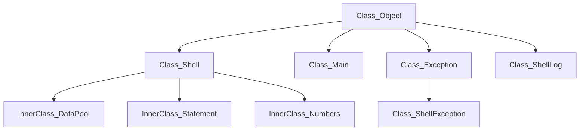

# Java 表达式求值实验报告

<p align="right">2020.04.18 Sun.  软件学院 四班 1813045 于海龙</p>
&nbsp;&nbsp;&nbsp;&nbsp;&nbsp;&nbsp;&nbsp;&nbsp;完全重新编写代码，重新设计类的关系结构，并将返回String类型以表达程序异常的方式转换为在错误发生处抛出异常的方式进行处理。在原有允许声明多变量的基础上增加了部分数据类型。增加对退出Shell和清空变量池的支持。

## 关系图



&nbsp;&nbsp;&nbsp;&nbsp;&nbsp;&nbsp;&nbsp;&nbsp;Numbers是使用的数据类型，存储包括变量名、取值、变量类型和final类型，包括静态成员运算列表和类型列表；DataPool储存所有已经声明的变量，保存变量名称和Numbers对象的键值对；Statement存储输入的语句，包括判断输入语句类型、处理语句和执行语句操作。其中Numbers、Statement和DataPool均为Shell的内部类。


<center>
<figure class="half">
    
</figure>
</center>


```Java
package ShellWithException;

import java.io.IOException;
import java.lang.reflect.InvocationTargetException;
import java.lang.reflect.Method;
import java.lang.Double;
import java.lang.Float;

import java.math.BigDecimal;
import java.math.BigInteger;
import java.util.Scanner;
import java.util.HashMap;
import java.util.Vector;
import java.util.Stack;

import java.util.logging.Level;
import java.util.logging.Logger;
import java.util.logging.FileHandler;
import java.util.logging.SimpleFormatter;

class ShellLog{
    String path;
    Logger logger;
    ShellLog(String FilePath,String Name) throws IOException{
        this.path=FilePath;
        this.logger=Logger.getLogger(Name+"ShellLogger");
        this.logger.setLevel(Level.ALL);
        FileHandler fileHander=new FileHandler(path+Name+"Shell.log");
        fileHander.setFormatter(new SimpleFormatter());
        logger.setUseParentHandlers(false);
        logger.addHandler(fileHander);
//        this.logger.addHandler(new FileHandler(path+Name+"Shell.log"));
        logger.setLevel(Level.SEVERE);
    }
    ShellLog(String FilePath) throws IOException {
        this.path=FilePath;
        this.logger=Logger.getLogger("ShellLogger");
        this.logger.setLevel(Level.ALL);
        FileHandler fileHander=new FileHandler(path+"Shell.log");
        fileHander.setFormatter(new SimpleFormatter());
        logger.setUseParentHandlers(false);
        logger.addHandler(fileHander);
//        this.logger.addHandler(new FileHandler(path+"Shell.log"));
        logger.setLevel(Level.SEVERE);
    }
}
class ShellException extends Exception{//Exception of JShell, it just looks like common exception now.
    ShellException(String Message,String Name){
        super(Message);
        Logger loggerTemp=Logger.getLogger(Name+"ShellLogger");
        loggerTemp.severe(Message);
    }
    ShellException(String Message){
        super(Message);
        Logger loggerTemp=Logger.getLogger("ShellLogger");
        loggerTemp.severe(Message);
    }
}
class Shell{// Exit the shell by using "exit();".
    DataPool dataPool;// Store all variable of the shell, you can clear it by "clear();".
    ShellLog logger;
    Shell(){
        this.dataPool=new DataPool();
    }
    public void run() throws Exception {
        logger=new ShellLog("./");
        Scanner inner=new Scanner(System.in);
        while(inner.hasNext()){
            String input=inner.nextLine();
            if(input.replace(" ","").equals("exit();")){
                this.exit();
                break;
            }
            else if(input.replace(" ","").equals("clear();")){
                this.clearDataPool();
            }
            else{
                Statements statement=new Statements(input);
                if(statement.getStatment().length()==0){
                    continue;
                }
                String type=statement.getType(); // Detection the type of statement: define, assign and calculate.
                Method execute=statement.getClass().getMethod(type, HashMap.class);
                execute.invoke(statement, this.dataPool.values);
            }
        }
    }
    // Inner Class DataPool.
    class DataPool{
        HashMap<String,Numbers> values=new HashMap<String,Numbers>();
        public void clear(){
            this.values.clear();
        }
        public Numbers getNumbers(String Name) throws Exception {
            if(values.containsKey(Name)){
                return values.get(Name);
            }
            else{
                throw new ShellException("wrong - variable undefined");
            }
        }
        public void setNumbers(String Name,String Value) throws Exception {
            if(values.containsKey(Name)){
                Numbers temp=values.get(Name);
                if(temp.checkType(Value)){
                    temp.setValue(Value);
                }
                else{
                    throw new ShellException("wrong - wrong data type");
                }
            }
            else{
                throw new ShellException("wrong - variable undefined");
            }
        }
    }

    // Inner Class Statements.
    class Statements{
        String Input;
        String statement;
        Vector<String> expression;
        Vector<String> polish;
        Statements(String Input) throws Exception {
            this.Input=Input;
            this.statement=Input;
            this.statement=this.statement.replace(" ","");
            this.statement=this.statement.replace("?","");
            this.statement=this.statement.replace(";","");
            if(!bracketsMatching(this.statement)){
                throw new ShellException("wrong - error expression");
            }
        }
        public boolean bracketsMatching(String inputLine){
            Stack<Character> brackets=new Stack<Character>();
            for(int i=0;i<inputLine.length();i++){
                if(inputLine.charAt(i)=='('){
                    brackets.push('(');
                }
                else if(inputLine.charAt(i)==')'){
                    if(brackets.empty()||brackets.peek().equals(')')){
                        return false;
                    }
                    else if(brackets.peek().equals('(')){
                        brackets.pop();
                    }
                }
            }
            return (brackets.empty());
        }
        public String getStatment(){
            return this.statement;
        }
        public String getType() throws Exception{
            int length=6;
            length=Math.min((statement).length(),6);
            String judgeType=this.statement.substring(0,length);
            if(judgeType.contains("final")){
                return "define";
            }
            else{
                for(String type:Numbers.types.keySet()){
                    if(judgeType.contains(type)){
                        return "define";
                    }
                }
                if(this.statement.charAt(this.statement.length()-1)=='='){
                    return "calculate";
                }
                else if(this.statement.contains("=")){
                    return "assign";
                }
                else{
                    throw new ShellException("wrong - wrong expression");
                }
            }
        }
        public void define(HashMap<String,Numbers> values) throws Exception{
            System.out.println("Defined");
            boolean Final=false;
            if(this.statement.contains("final")){
                Final=true;
                this.statement=this.statement.substring(5);
            }
            String type="";
            for(String temp:Numbers.types.keySet()){
                if(this.statement.contains(temp)){
                    type=temp;
                    break;
                }
            }
            this.statement=this.statement.substring(type.length());
            int start=0;
            int middle=0;
            int end=0;
            for(int i=0;i<this.statement.length();i++){
                if(i==this.statement.length()-1){
                    end=i;
                    if(middle!=start){
                        String Name=this.statement.substring(start,middle);
                        if(values.containsKey(Name)){
                            throw new ShellException("wrong - redefine variable");
                        }
                        String Value=this.statement.substring(middle+1,end+1);
                        if(!checkValidName(Name)){
                            throw new ShellException("wrong - invalid variable name");
                        }
                        values.put(Name,new Numbers(Name,type,Value,Final));
                        System.out.println(Name+" "+Value);
                        return;
                    }
                    else{
                        String Name=this.statement.substring(start,end+1);
                        if(values.containsKey(Name)){
                            throw new ShellException("wrong - redefine variable");
                        }
                        if(!checkValidName(Name)){
                            throw new ShellException("wrong - invalid variable name");
                        }
                        values.put(Name,new Numbers(Name,type,Final));
                        System.out.println(Name);
                        return;
                    }
                }
                if(this.statement.charAt(i)=='='){
                    middle=i;
                }
                else if(this.statement.charAt(i)==','){
                    end=i;
                    if(middle!=start){
                        String Name=this.statement.substring(start,middle);
                        if(values.containsKey(Name)){
                            throw new ShellException("wrong - redefine variable");
                        }
                        String Value=this.statement.substring(middle+1,end);
                        if(!checkValidName(Name)){
                            throw new ShellException("wrong - invalid variable name");
                        }
                        values.put(Name,new Numbers(Name,type,Value,Final));
                        System.out.println(Name+" "+Value);
                    }
                    else{
                        String Name=this.statement.substring(start,end);
                        if(values.containsKey(Name)){
                            throw new ShellException("wrong - redefine variable");
                        }
                        if(!checkValidName(Name)){
                            throw new ShellException("wrong - invalid variable name");
                        }
                        values.put(Name,new Numbers(Name,type,Final));
                        System.out.println(Name);
                    }
                    start=middle=end+1;
                }
                System.out.println(values.keySet());
            }
        }
        public void assign(HashMap<String,Numbers> values) throws Exception{
            // Maybe check /+=/-=/*=//= in the function assign later.
            int start=0;
            int middle=0;
            String Name="";
            String Value="";
            for(int end=0;end<this.statement.length();end++){
                if(end==this.statement.length()-1){
                    Value=this.statement.substring(middle+1);
                    System.out.println(Name+" "+Value);
                    System.out.println(values.keySet());
                    System.out.println(values.containsKey(Name));
                    if(values.containsKey(Name)){
                        values.get(Name).setValue(Value);
                        System.out.println("Assign!");
                    }
                    else{
                        throw new ShellException("wrong - variable undefined");
                    }
                    break;
                }
                if(this.statement.charAt(end)=='='){
                    middle=end;
                    Name=this.statement.substring(start,middle);
                }
                else if(this.statement.charAt(end)==','){
                    start=end+1;
                    Value=this.statement.substring(middle+1,end);
                    System.out.println(Name+" "+Value);
                    System.out.println(values.keySet());
                    System.out.println(values.containsKey(Name));
                    if(values.containsKey(Name)){
                        System.out.println(Name+" "+Value);
                        values.get(Name).setValue(Value);
                    }
                    else{
                        throw new ShellException("wrong - variable undefined");
                    }
                }
            }
            System.out.println("Assign");
        }
        public void calculate(HashMap<String,Numbers> values) throws Exception{
            this.expression=new Vector<String>();
            this.polish=new Vector<String>();
            System.out.println("Calculate");
            System.out.println("-- Divided");
            divided(); // Divided the String by operator.
            System.out.println("-- Replace");
            replaceWithValue(values);
            System.out.println("-- Change");
            infixToPolish(); // Change vector into polish.
            System.out.println("-- Eval");
            eval(); // Calculate the polish.
        }
        public void replaceWithValue(HashMap<String,Numbers> values) throws Exception{
            System.out.println("Replace Variable with Value");
            for(int i=0;i<this.expression.size();i++){
                boolean operators=false;
                boolean numbers=false;
                for(String operator:Numbers.operators.keySet()) {
                    if (this.expression.elementAt(i).equals(operator)) {
                        operators = true;
                        break;
                    }
                }
                if(!operators){
                    try{
                        Double.parseDouble(this.expression.elementAt(i));
                        numbers=true;
                    }
                    catch(Exception ignored){
                    }
                    if(!numbers) {
                        try {
                            this.expression.setElementAt(values.get(this.expression.elementAt(i)).getValue(),i);
                        }
                        catch(Exception e) {
                            if(e.getClass().equals(ShellException.class)){
                                throw e;
                            }
                            else{
                                throw new ShellException("wrong - variable undefined");
                            }
                        }
                    }
                }
            }
        }
        public void eval() throws Exception{
            Stack<String> resultTemp=new Stack<String>();
            for(int i=polish.size()-1;i>=0;i--){
                boolean operatorBool=false;
                for(String operator:Numbers.operators.keySet()){
                    if(polish.get(i).equals(operator)){
                        operatorBool=true;
                        String leftValue=resultTemp.pop();
                        String rightValue=resultTemp.pop();
                        String temp=Numbers.dealTwoVariable(leftValue,rightValue,polish.get(i)); // Variable.
                        resultTemp.push(temp);
                        System.out.println(leftValue+polish.get(i)+rightValue+"="+temp);
                        break;
                    }
                }
                if(!operatorBool){
                    resultTemp.push(polish.get(i));
                }
            }
            polish.clear();
            for(String s:resultTemp){
                if(s.contains(".")){
                    polish.addElement(String.format("%1.2f",Float.parseFloat(s))); // Keep two decimals.
                }
                else{
                    polish.addElement(s);
                }
            }
            System.out.println(this.polish.get(0));
        }
        public void infixToPolish() throws Exception{
            int brackets=0;
            Stack<String> operatorTemp=new Stack<String>();
            Stack<String> numberTemp=new Stack<String>();
            operatorTemp.push("#");
            for(int i=expression.size()-1;i>=0;i--){
                boolean operatorBool=false;
                for(String operator:Numbers.operators.keySet()){
                    if(expression.get(i).equals(operator)){
                        operatorBool=true;
                        if(expression.get(i).equals(")")){
                            brackets++;
                            operatorTemp.push(")");
                            break;
                        }
                        if(expression.get(i).equals("(")){
                            while(!operatorTemp.peek().equals(")")){
                                numberTemp.push(operatorTemp.pop());
                            }
                            operatorTemp.pop();
                            brackets--;
                            break;
                        }
                        if(brackets>0){int value=Numbers.operators.get(expression.get(i));
                            while(value<Numbers.operators.get(operatorTemp.peek())&&Numbers.operators.get(operatorTemp.peek())<Numbers.operators.get(")")){
                                numberTemp.push(operatorTemp.pop());
                            }
                            operatorTemp.push(expression.get(i));
                            break;
                        }
                        else{
                            int value=Numbers.operators.get(expression.get(i));
                            while(value<Numbers.operators.get(operatorTemp.peek())){
                                numberTemp.push(operatorTemp.pop());
                            }
                            operatorTemp.push(expression.get(i));
                            break;
                        }
                    }
                }
                if(!operatorBool){
                    System.out.println(this.expression.get(i));
                    numberTemp.push(expression.get(i));
                }
            }
            System.out.println(this.expression);
            this.polish.clear();
            while(!operatorTemp.peek().equals("#")){
                numberTemp.push(operatorTemp.pop());
            }
            while(!numberTemp.empty()){
                this.polish.add(numberTemp.pop());
            }
            System.out.println(this.polish);
        }
        public void divided() throws Exception{
            // Maybe add check ++/-- here.
            int head=0;
            for(int i=0;i<this.statement.length();i++){
                for(String operator:Numbers.operators.keySet()){
                    if(this.statement.charAt(i)==operator.charAt(0)){
                        if(head!=i) {
                            this.expression.add(this.statement.substring(head, i));
                        }
                        head=i+1;
                        this.expression.addElement(operator);
                        break;
                    }
                }
            }
            if(head!=this.statement.length()-1) {
                try{
                    this.expression.addElement(this.statement.substring(head,this.statement.length()-1));
                }
                catch(Exception e) {
                    throw new ShellException("wrong - error expression");
                }
            }
            System.out.println(this.expression);
        }
        public boolean checkValidName(String Name){
            if(Name.length()<=0){
                return false;
            }
            else{char head=Name.charAt(0);
                if((!(head>='a'&&head<='z'))&&(!(head>='A'&&head<='Z'))){
//                    throw new ShellException("wrong - wrong variable name");
                    return false;
                }
                for(int i=0;i<Name.length();i++){
                    head=Name.charAt(i);
                    if((!(head>='a'&&head<='z'))&&(!(head>='A'&&head<='Z'))&&(!(head>='0'&&head<='9'))&&(head!='_')){
//                        throw new ShellException("wrong - wrong variable name");
                        return false;
                    }
                }
                return true;
            }
        }
    }

    // Inner Class Numbers.
    static class Numbers{
        static HashMap<String,Integer> types=new HashMap<String,Integer>();
        static HashMap<String,String> typeObject=new HashMap<String,String>();
        static HashMap<String,Integer> operators=new HashMap<String,Integer>();
        static{
            types.put("byte",10);
            types.put("short",20);
            types.put("int",30);
            types.put("long",40);
            types.put("float",60);
            types.put("double",80);
//            types.put("Decimal",100);

            typeObject.put("byte","Byte");
            typeObject.put("short","Short");
            typeObject.put("int","Integer");
            typeObject.put("long","Long");
            typeObject.put("float","Float");
            typeObject.put("double","Double");
//            typeObject.put("Decimal","BigDecimal");

            operators.put("#",0);
            operators.put("+",20);
            operators.put("-",20);
            operators.put("*",50);
            operators.put("/",50);
            operators.put("%",50);

            operators.put("(",100);
            operators.put(")",100);
        }
        Numbers(String Name,String Type,String Value,boolean Final) throws Exception {
            if(checkType(Type,Value)){
                this.Name=Name;
                this.Type=Type;
                this.Value=Value;
                this.Final=Final;
            }
            else{
                throw new ShellException("wrong - wrong data type");
            }
            this.format();
        }
        Numbers(String Name,String Type,boolean Final) throws Exception {
            if(checkType(Type,"0")){
                this.Name=Name;
                this.Type=Type;
                this.Value="";
                this.Final=Final;
            }
            else{
                throw new ShellException("wrong - wrong data type");
            }
        }
        String Name;
        String Type;
        String Value;
        boolean Final;
        public void format() throws Exception {
            int level=getTypeLevel(this.Type);
            if(level>=getTypeLevel("float")){
                this.Value=String.valueOf(Double.parseDouble(this.Value));
            }
            else{
                this.Value=String.valueOf(Long.parseLong(this.Value));
            }
        }
        public static boolean checkType(String typeOut,String value) throws Exception {// Check the Value is suitable for Type.
            int level=getTypeLevel(typeOut);
            int type=100;
            if(value.contains(".")) {
                try{
                    Double.parseDouble(value);
                    type=Numbers.types.get("double");
                    Float.parseFloat(value);
                    type=Numbers.types.get("float");
                }
                catch(Exception ignored) {

                }
            }
            else{
                try{
                    Long.parseLong(value);
                    type=Numbers.types.get("long");
                    Integer.parseInt(value);
                    type=Numbers.types.get("int");
                    Short.parseShort(value);
                    type=Numbers.types.get("short");
                    Byte.parseByte(value);
                    type=Numbers.types.get("byte");
                }
                catch(Exception ignored){

                }
            }
            if(level>=type){
                return true;
            }
            else{
                return false;
            }
        }
        public static String getType(String value){
            String type="Double";
            if(value.contains(".")) {
                try{
                    Double.parseDouble(value);
                    type="double";
                    Float.parseFloat(value);
                    type="float";
                }
                catch(Exception ignored) {

                }
            }
            else{
                try{
                    Long.parseLong(value);
                    type="long";
                    Integer.parseInt(value);
                    type="int";
                    Short.parseShort(value);
                    type="short";
                    Byte.parseByte(value);
                    type="byte";
                }
                catch(Exception ignored){

                }
            }
            return type;
        }
        public static int getTypeLevel(String type) throws Exception{
            return Numbers.types.get(type);
        }
        public static String dealTwoVariable(String leftValue,String rightValue,String operator) throws Exception {
            String result="0";
            String leftType=getType(leftValue);
            String rightType=getType(rightValue);
            int leftLevel=getTypeLevel(leftType);
            int rightLevel=getTypeLevel(rightType);
            leftLevel=Math.max(leftLevel,rightLevel);
            if(leftLevel==rightLevel){
                leftType=rightType;
            }
            System.out.println("Got types."+leftType);
            Class NumberClass=Class.forName("java.lang."+Numbers.typeObject.get(leftType));
            Method valueGet=NumberClass.getDeclaredMethod("valueOf",String.class);
            if(Numbers.types.get(leftType)>=Numbers.types.get("float")){
                BigDecimal leftNumber=new BigDecimal(leftValue);
                BigDecimal rightNumber=new BigDecimal(rightValue);
                BigDecimal resultNumber=new BigDecimal(0);
                switch(operator){
                    case "%":
                        resultNumber=leftNumber.divideAndRemainder(rightNumber)[1];
                        break;
                    case "+":
                        resultNumber=leftNumber.add(rightNumber);
                        break;
                    case "-":
                        resultNumber=leftNumber.subtract(rightNumber);
                        break;
                    case "*":
                        resultNumber=leftNumber.multiply(rightNumber);
                        break;
                    case "/":
                        if(rightNumber.compareTo(BigDecimal.ZERO)==0){
                            throw new ShellException("wrong - error expression");
                        }
                        resultNumber=leftNumber.divide(rightNumber,100,BigDecimal.ROUND_HALF_UP);
                        break;
                    default:
                        resultNumber.subtract(resultNumber);
                }
                result=String.valueOf(resultNumber);
            }
            else{
                BigInteger leftNumber=new BigInteger(leftValue);
                BigInteger rightNumber=new BigInteger(rightValue);
                BigInteger resultNumber=new BigInteger(String.valueOf(0));
                switch(operator){
                    case "%":
                        resultNumber=leftNumber.divideAndRemainder(rightNumber)[1];
                        break;
                    case "+":
                        resultNumber=leftNumber.add(rightNumber);
                        break;
                    case "-":
                        resultNumber=leftNumber.subtract(rightNumber);
                        break;
                    case "*":
                        resultNumber=leftNumber.multiply(rightNumber);
                        break;
                    case "/":
                        if(resultNumber.equals(rightNumber)){
                            throw new ShellException("wrong - error expression");
                        }
                        resultNumber=leftNumber.divide(rightNumber);
                        break;
                    default:{
                        resultNumber.subtract(resultNumber);
                    }
                }
                result=String.valueOf(resultNumber);
            }
            return result;
        }
        public boolean checkType(String value) throws Exception {// Check the value is suitable for this type.
            int level=getTypeLevel(getType(value));
            int effective=Numbers.types.get(this.Type);
            return level<=effective;
        }
        public void setValue(String value) throws Exception {
            System.out.println("setValue "+value);
            if(this.Final){
                throw new ShellException("wrong - modify final variable");
            }
            else{
                if(this.checkType(value)){
                    this.Value=value;
                }
                else{
                    throw new ShellException("wrong - wrong data type");
                }
            }
            this.format();
        }
        public String getValue() throws Exception{
            if(this.Value.equals("")){
                throw new ShellException("wrong - variable unassigned");
            }
            else{
                return this.Value;
            }
        }
        public String getName(){
            return this.Name;
        }
        public String getType(){
            return this.Type;
        }
        public boolean getFinal(){
            return this.Final;
        }
    }

    // Functions of Shell.
    public void exit(){
        this.clearDataPool();
    }
    public void clearDataPool(){
        this.dataPool.clear();
    }
}


public class Main {
    public static void main(String []args) throws Exception {
        Shell shell=new Shell();
        try {
            shell.run();
        }
        catch(InvocationTargetException e) {
            System.out.println(e.getTargetException().getMessage());
        }
        catch(Exception e){
            System.out.println(e);
        }
    }
}

```


```
&nbsp;&nbsp;&nbsp;&nbsp;&nbsp;&nbsp;&nbsp;&nbsp;
```

